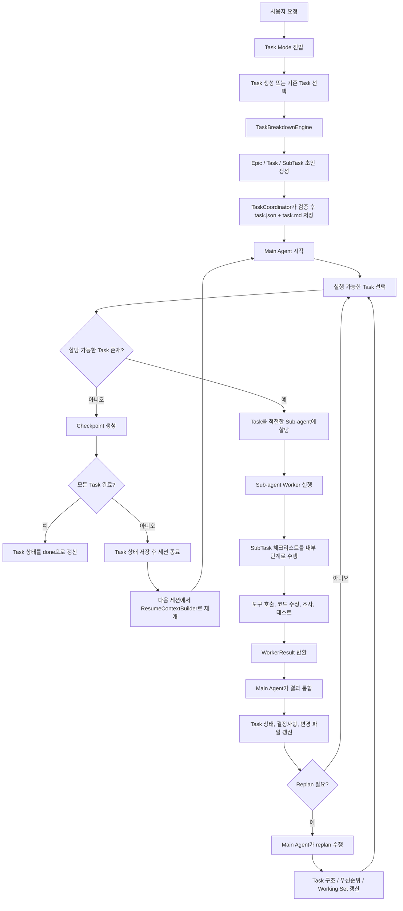

# TASK 모드 시스템 설계

**날짜:** 2026-04-19
**상태:** 제안됨

## 개요

현재 프로젝트의 대화 모델은 `conversation + history + memory search` 중심이다. 이 구조는 짧은 대화나 단발성 작업에는 적합하지만, 긴 코딩 작업을 여러 세션에 걸쳐 안정적으로 이어가는 데에는 한계가 있다.

핵심 문제는 다음과 같다.

- 세션의 정본이 `대화 transcript`에 가깝다
- 컨텍스트 압축은 가능하지만, 작업 상태를 durable state로 보존하지 않는다
- 다음 세션은 "어떤 TASK를 이어가는가"보다 "최근 대화를 얼마나 잘 되살리는가"에 의존한다
- 작업 분해 결과(Task List)가 대화 안에 묻히며, 실행 상태와 분리되어 있지 않다

이를 해결하기 위해 **Chat Mode와 별도로 Task Mode를 도입**한다. Task Mode의 핵심은 세션을 이어가는 것이 아니라 **TASK 상태를 이어가는 것**이다.

## 목표

- 장기 코딩 작업을 TASK 단위로 생성, 저장, 재개할 수 있어야 한다
- 전체 transcript가 아니라 `Task State + Checkpoint + Working Set` 기반으로 세션을 재개해야 한다
- Epic / Task / SubTask 구조를 기반으로 작업을 체계적으로 분해해야 한다
- Main Agent는 계획/조정, Sub-agent는 Task 실행을 담당해야 한다
- SubTask는 별도 agent가 아니라 실행 체크리스트로 유지해야 한다
- 기존 Chat Mode는 그대로 유지해야 한다

## 비목표

- 모든 대화를 자동으로 TASK로 승격하지 않는다
- RAG memory를 Task 재개의 정본으로 사용하지 않는다
- 기존 conversation 시스템을 즉시 제거하지 않는다
- SubTask까지 모두 agent로 분산 실행하지 않는다

## 핵심 원칙

### 1. Task가 정본이다

Task Mode에서 저장의 중심은 Conversation이 아니라 Task이다.  
Conversation은 `한 번의 실행 세션(TaskRun)` 기록일 뿐이며, 다음 세션 재개의 기준은 아니다.

### 2. Resume는 검색 문제가 아니라 상태 복원 문제다

다음 세션은 관련 대화를 잘 검색해서 이어붙이는 방식이 아니라, 명시적으로 저장된 Task 상태를 로드해서 시작해야 한다.

### 3. Task 분해와 Task 실행을 분리한다

- Task Breakdown: 무엇을 어떤 순서로 할지 정의
- Task Execution: 정의된 Task를 실제로 수행

이 둘을 같은 프롬프트 한 번으로 해결하지 않는다.

### 4. Main Agent와 Worker Agent의 책임을 분리한다

- Main Agent: Epic 관리, Task 선택, 결과 통합, checkpoint 작성, replan
- Sub-agent: 개별 Task 실행
- SubTask: Worker 내부 체크리스트

## 모드 구조

### Chat Mode

기존 구조 유지:

- 자유 대화
- 짧은 실험
- 단발성 도구 호출
- RAG memory/knowledge 보조 사용

### Task Mode

새로운 구조:

- Task 생성
- Task breakdown
- Task 실행
- Checkpoint 저장
- Task 재개
- 완료/보류/재계획 관리

## 전체 아키텍처

```text
User
  ↓
Task Mode UI / API
  ↓
TaskCoordinator
  ├─ TaskBreakdownEngine
  ├─ ResumeContextBuilder
  ├─ CheckpointWriter
  └─ TaskStateStore
            ↓
        Main Agent
            ├─ Epic 관리
            ├─ Task 선택
            ├─ Worker 결과 통합
            └─ Replan / Checkpoint
                    ↓
              Sub-agent Worker
                    ├─ Task 1 실행
                    ├─ Task 2 실행
                    └─ Task N 실행
```

## 전체 프로세스 다이어그램



## 도메인 모델

### Task

Task Mode의 aggregate root.

```ts
interface TaskRecord {
  id: string;
  title: string;
  goal: string;
  mode: 'task';
  status: 'active' | 'blocked' | 'review' | 'done' | 'archived';
  createdAt: number;
  updatedAt: number;
  source?: {
    type: 'prompt' | 'spec' | 'issue' | 'manual';
    ref?: string;
  };
  canonicalPlan?: string;
  acceptanceCriteria: string[];
  epics: TaskEpic[];
  tasks: TaskItem[];
  decisions: TaskDecision[];
  changedFiles: string[];
  openQuestions: string[];
  latestCheckpointId?: string;
  activeRunId?: string;
}
```

### Epic

Epic은 실행 단위가 아니라 관리 단위다.

```ts
interface TaskEpic {
  id: string;
  title: string;
  description: string;
  status: 'todo' | 'in_progress' | 'done' | 'dropped';
  taskIds: string[];
}
```

### TaskItem

실제 Sub-agent가 수행하는 실행 단위.

```ts
interface TaskItem {
  id: string;
  epicId: string;
  title: string;
  description: string;
  status: 'todo' | 'in_progress' | 'blocked' | 'done' | 'dropped';
  priority: 'high' | 'medium' | 'low';
  size: 'S' | 'M' | 'L';
  dependsOn: string[];
  definitionOfDone: string[];
  subtasks: ChecklistItem[];
  writeScope?: string[];
  allowedTools?: string[];
  owner?: 'main' | 'coder' | 'researcher' | 'analyst' | 'verifier';
  resultSummary?: string;
  blocker?: string;
}
```

### ChecklistItem (SubTask)

SubTask는 별도 agent로 실행하지 않는다.

```ts
interface ChecklistItem {
  id: string;
  text: string;
  checked: boolean;
}
```

### TaskRun

한 세션의 실행 기록.

```ts
interface TaskRun {
  id: string;
  taskId: string;
  conversationId?: string;
  startedAt: number;
  endedAt?: number;
  model: string;
  status: 'running' | 'completed' | 'aborted' | 'failed';
  assignedTaskIds: string[];
  summary?: string;
}
```

### TaskCheckpoint

다음 세션 재개의 기준이 되는 durable snapshot.

```ts
interface TaskCheckpoint {
  id: string;
  taskId: string;
  runId?: string;
  createdAt: number;
  summary: string;
  completedTaskIds: string[];
  inProgressTaskIds: string[];
  blockedTaskIds: string[];
  changedFiles: string[];
  decisions: string[];
  openQuestions: string[];
  nextActions: string[];
  resumePrompt: string;
  markdownPath: string;
}
```

## 저장 구조

```text
data/tasks/{taskId}/
├── task.json
├── task.md
├── runs/
│   └── {runId}.json
├── checkpoints/
│   ├── {timestamp}.json
│   └── {timestamp}.md
└── artifacts/
```

### 정본 구분

- `task.json`: 기계용 정본
- `task.md`: 사람이 읽는 요약본
- `checkpoints/*.json`: resume용 구조화 데이터
- `checkpoints/*.md`: 사람이 읽는 handoff 문서

`.md`만 정본으로 쓰지 않는다. Markdown은 사람에게 친화적이지만, 재개 안정성은 JSON이 더 높다.

## Task Breakdown 엔진

### 기본 방향

기존 `.claude/skills/task-breakdown`는 그대로 런타임 스킬로 연결하지 않고, **Task Mode의 전용 분해 엔진**으로 재구성한다.

이유:

- 현재 프로젝트의 스킬 런타임은 `.claude/skills`를 직접 읽지 않는다
- 현재 스킬 로더는 참조 문서/폴더 구조를 충분히 보존하지 못한다
- 현재 `/skill` UX는 `skillId` 기반 실행 경로가 완전히 연결되어 있지 않다
- Task Breakdown은 일반 채팅용 스킬보다 Task 생성기 역할이 더 적합하다

### 엔진 구성

```text
TaskBreakdownEngine
  ├─ SourceLoader
  │   ├─ user goal
  │   ├─ docs/plans/*
  │   ├─ spec file
  │   └─ repo context
  ├─ PromptAssembler
  │   ├─ vendorized task-breakdown SKILL.md
  │   ├─ references/output-template.md
  │   ├─ references/decomposition-patterns.md
  │   └─ references/edge-cases.md
  ├─ LLM Draft Generator
  ├─ Structured Parser
  └─ Markdown Renderer
```

### vendor-in 전략

원본 스킬은 다음 위치로 프로젝트 안에 포함한다.

```text
vendor/claude-skills/task-breakdown/
├── SKILL.md
└── references/
```

Task Breakdown 엔진은 이 원본 문서를 프롬프트 자산으로 사용하되, 결과 저장 규칙과 충돌 처리, 파일명 결정은 코드에서 강제한다.

### 출력 전략

LLM에게 바로 최종 Markdown만 맡기지 않는다.

1. 먼저 구조화된 중간 포맷(JSON 유사 구조) 생성
2. 서버 코드에서 검증
3. 최종 Markdown 렌더링
4. `task.json`과 `task.md` 동시 저장

### 분해 계층

- Epic: Main Agent가 관리하는 상위 묶음
- Task: Sub-agent가 수행하는 실행 단위
- SubTask: Worker 내부 체크리스트

## Main Agent / Sub-agent 실행 모델

### Main Agent 책임

- 사용자 요구사항 해석
- Epic/Task 구조 생성 또는 갱신
- 실행 가능한 다음 Task 선택
- Task를 적절한 Sub-agent에 할당
- 결과 통합
- Task 상태 갱신
- checkpoint 생성
- replan 판단

### Sub-agent 책임

- Task 1개 수행
- 내부 SubTask checklist를 따라 실행
- 코드 수정/조사/분석/검증 수행
- 결과를 구조화해서 반환

### SubTask 처리 방식

SubTask는 기본적으로 Worker 내부 체크리스트다.

예:

- 관련 파일 탐색
- 구현 범위 확인
- 코드 수정
- 테스트 추가
- 문서/상태 갱신

SubTask를 항상 별도 agent로 만들지 않는다. 오케스트레이션 비용이 과도해지고, 충돌 관리가 어려워진다.

### 예외적 nested delegation

다음 조건을 만족하는 경우에만 Task 내부에서 nested sub-agent를 허용한다.

- 외부 조사처럼 명확히 분리 가능한 작업
- 데이터 분석처럼 도구 구성이 확연히 다른 작업
- 검증 전용 역할이 필요한 경우

예:

- `researcher`: 외부 API/문서 조사
- `analyst`: 로그/데이터 해석
- `verifier`: 테스트와 회귀 확인

## Worker 결과 포맷

현재 서브에이전트는 자유 텍스트 결과만 반환한다. Task Mode에서는 구조화된 반환값이 필요하다.

```ts
interface WorkerResult {
  taskId: string;
  status: 'completed' | 'blocked' | 'failed';
  summary: string;
  completedSubtaskIds: string[];
  changedFiles: string[];
  artifacts?: string[];
  blocker?: string;
  followupSuggestions?: string[];
}
```

Sub-agent 실행 결과는 이 형식으로 파싱 가능해야 하며, TaskCoordinator는 이 결과를 기반으로 Task 상태를 갱신한다.

## TASK 모드 부트스트랩 / 캘리브레이션

### 목적

Task Mode는 실행 시작 전에 현재 머신과 Ollama 서버 설정이 실제로 감당 가능한 병렬 수준을 확인해야 한다.

특히 같은 모델을 Main Agent와 Worker Agent가 공유하는 경우, Sub-agent 수에 비례해 모델 수를 늘리는 것이 아니라 다음 두 값을 구분해서 다뤄야 한다.

- `numParallel`: 동일 모델의 동시 요청 처리 수
- `maxLoadedModels`: 동시에 메모리에 유지할 서로 다른 모델 수

따라서 Task Mode는 시작 시점에 **저장된 캘리브레이션 정보를 먼저 확인**하고, 필요하면 **QuickProbe**로 짧게 검증한 뒤 실제 실행 파라미터를 결정해야 한다.

### 기본 원칙

1. 매번 풀 캘리브레이션을 돌리지 않는다
2. 저장된 calibration profile을 우선 사용한다
3. Task Mode 시작 시에는 항상 QuickProbe로 현재 상태를 짧게 검증한다
4. QuickProbe 실패 시 보수적으로 한 단계 낮춘다
5. 프로필이 없거나 오래된 경우에는 safe default로 시작하고 백그라운드 재측정을 예약한다

### Calibration Profile

```ts
interface CalibrationProfile {
  id: string;
  model: string;
  numCtx: number;
  workloadType: 'main-agent' | 'worker-agent' | 'mixed-task-mode';
  recommendedNumParallel: number;
  recommendedMaxConcurrentSubagents: number;
  recommendedMaxLoadedModels: number;
  measuredAt: number;
  ollamaVersion?: string;
  machineFingerprint?: string;
  metrics: {
    p50LatencyMs: number;
    p95LatencyMs: number;
    throughputRps: number;
    errorRate: number;
    avgLoadDurationMs: number;
  };
}
```

### QuickProbe

QuickProbe는 저장된 추천값이 **지금 이 순간의 머신 상태에서도 안전한지** 확인하는 짧은 런타임 검증이다.

역할:

- 모델 warm 상태 확인
- 추천 병렬값으로 짧은 동시 요청 실행
- `load_duration`, latency, error 여부 확인
- 성공 시 추천값 유지
- 실패 시 `numParallel`과 `maxConcurrentSubagents`를 한 단계씩 낮춤

QuickProbe는 풀 벤치마크가 아니라 1~3초 내외의 짧은 sanity check여야 한다.

```ts
interface QuickProbeResult {
  ok: boolean;
  effectiveNumParallel: number;
  effectiveMaxConcurrentSubagents: number;
  effectiveMaxLoadedModels: number;
  warmLoad: boolean;
  reason?: string;
}
```

### 부트스트랩 흐름

```text
Task Mode 시작
  ↓
CalibrationProfileResolver
  ↓
저장된 profile 존재 여부 확인
  ├─ 없음 → safe defaults 적용 + background calibration 예약
  └─ 있음 → profile 유효성 확인
                ↓
            QuickProbe 실행
                ↓
        통과 → profile 추천값 적용
        실패 → 보수값으로 강등
                ↓
        EffectiveRuntimeConfig 생성
                ↓
          Main Agent / Sub-agent 실행
```

### EffectiveRuntimeConfig

Task Mode 실행 시 최종적으로 사용하는 값은 서버 설정값 자체가 아니라, 부트스트랩 후 계산된 **실효 런타임 값**이다.

```ts
interface EffectiveRuntimeConfig {
  model: string;
  numCtx: number;
  effectiveNumParallel: number;
  effectiveMaxConcurrentSubagents: number;
  effectiveMaxLoadedModels: number;
  source: 'safe-default' | 'calibration-profile' | 'quick-probe-adjusted';
}
```

### 선택 규칙

#### 1. `effectiveNumParallel`

- 기본 후보값: `min(profile.recommendedNumParallel, server.numParallel)`
- QuickProbe 실패 시 1씩 낮춘다
- 최소값은 1로 보장한다

#### 2. `effectiveMaxConcurrentSubagents`

- `effectiveNumParallel`보다 클 수 없다
- 기본적으로 `effectiveMaxConcurrentSubagents <= effectiveNumParallel`
- 안전성 우선이면 `effectiveMaxConcurrentSubagents = effectiveNumParallel - 1`도 허용한다

#### 3. `effectiveMaxLoadedModels`

Sub-agent 수가 아니라 **동시에 살아 있어야 하는 모델 종류 수**를 기준으로 설정한다.

예:

- chat 모델만 사용: 1
- chat + embedding: 2
- chat + embedding + image/fallback 가능성: 3

### QuickProbe 입력

- `model`
- `num_ctx`
- `candidateNumParallel`
- `candidateMaxConcurrentSubagents`
- workload type
- 짧은 probe prompt

Probe prompt는 실제 Task Mode와 비슷한 토큰 특성을 가져야 하지만, 너무 길어서는 안 된다.

예:

- Main Agent probe: 짧은 계획 요약 요청
- Worker Agent probe: 짧은 구현/분석 요청
- Mixed probe: Main 1 + Worker N 형태 동시 요청

### QuickProbe 측정 지표

Ollama 응답 메트릭 기반:

- `total_duration`
- `load_duration`
- `prompt_eval_duration`
- `eval_duration`
- `eval_count`

파생 지표:

- latency p50 / p95
- tokens per second
- throughput
- reload 징후 (`load_duration` 재증가)
- error rate (timeout / 503 / aborted)

### QuickProbe 합격 조건

- 에러율 0%
- timeout 없음
- 503 없음
- p95 latency가 허용 임계치 이하
- `load_duration`이 갑자기 커지지 않음
- 처리량 이득이 의미 있게 유지됨

### Safe Default 정책

profile이 없거나 QuickProbe가 반복 실패하면 다음 보수값으로 시작한다.

- `effectiveNumParallel = 1`
- `effectiveMaxConcurrentSubagents = 1`
- `effectiveMaxLoadedModels = min(server.maxLoadedModels, 2)`

이 상태로 Task Mode를 시작하되, 백그라운드에서 캘리브레이션을 예약한다.

### Stale Profile 정책

다음 조건 중 하나라도 만족하면 profile을 stale로 간주한다.

- 모델이 바뀜
- `num_ctx`가 크게 바뀜
- Ollama 버전이 바뀜
- 마지막 측정이 오래됨
- 머신 fingerprint가 달라짐

stale profile은 완전히 무시하지 않고, 추천값보다 1단계 낮춘 후보로 QuickProbe를 수행한다.

### Full Calibration과 QuickProbe의 차이

| 항목 | Full Calibration | QuickProbe |
|------|------------------|------------|
| 목적 | 최적 병렬값 탐색 | 현재 상태 검증 |
| 실행 시점 | 최초 설정/주기적 재측정 | Task Mode 시작 시마다 |
| 비용 | 높음 | 낮음 |
| 탐색 범위 | 1..N 전체 후보 | 추천값 주변 좁은 범위 |
| 결과 | CalibrationProfile 저장 | EffectiveRuntimeConfig 생성 |

### 구현 위치

| 파일 | 역할 |
|------|------|
| `src/lib/tasks/calibration-profile.ts` | profile 저장/조회 |
| `src/lib/tasks/quick-probe.ts` | QuickProbe 실행 |
| `src/lib/tasks/bootstrap.ts` | Task Mode 부트스트랩 orchestration |
| `src/app/api/tasks/bootstrap/route.ts` | 부트스트랩 API |

### 권장 실행 순서

1. Task Mode 진입
2. Bootstrap API 호출
3. profile 조회
4. QuickProbe 실행
5. `EffectiveRuntimeConfig` 계산
6. 해당 값으로 Main Agent / Sub-agent 시작

## Resume 모델

### ResumeContextBuilder

다음 세션은 transcript 전체를 로드하지 않고, 아래 조합으로 컨텍스트를 조립한다.

1. Task 목표
2. Epic/Task 현재 상태
3. 최신 checkpoint
4. 현재 working set
5. 필요한 경우 최근 TaskRun 요약
6. 선택적 보조 정보
   - memory search 결과
   - knowledge search 결과

### 컨텍스트 우선순위

```text
Task State
  > Latest Checkpoint
  > Current Working Set
  > Recent Run Summary
  > Memory / Knowledge
  > Full Transcript
```

Full transcript는 기본 입력이 아니라 디버깅/참조용 보조 자료다.

## Checkpoint 모델

### 생성 시점

- Task 생성 직후 초기 분해 완료 시
- Task 완료 시
- Main Agent가 replan을 수행한 직후
- 사용자 명시 요청 시 (`/task checkpoint`)
- 장시간 작업 후 응답 완료 시 자동 생성

### checkpoint 문서 구성

```md
---
taskId: task_xxx
checkpointId: cp_xxx
status: active
createdAt: 2026-04-19T12:34:56.000Z
---

# Goal
# Current State
# Completed Tasks
# In Progress / Blocked
# Decisions
# Changed Files
# Open Questions
# Next Actions
# Resume Prompt
```

## API 설계

### Task API

| Method | Path | 설명 |
|--------|------|------|
| POST | `/api/tasks` | 새 Task 생성 + 초기 breakdown |
| GET | `/api/tasks` | Task 목록 |
| GET | `/api/tasks/[id]` | Task 상세 |
| PUT | `/api/tasks/[id]` | Task 메타데이터/상태 갱신 |
| POST | `/api/tasks/[id]/resume` | Resume context 생성 |
| POST | `/api/tasks/[id]/checkpoint` | checkpoint 생성 |
| POST | `/api/tasks/[id]/execute` | Main Agent가 다음 Task 실행 |
| POST | `/api/tasks/[id]/replan` | breakdown 재조정 |
| POST | `/api/tasks/[id]/complete` | Task 종료 |

### Breakdown API

| Method | Path | 설명 |
|--------|------|------|
| POST | `/api/tasks/breakdown` | 입력 기반 Epic/Task/SubTask 초안 생성 |

## UI/UX 설계

### 사이드바

기존 Conversation 목록과 분리하여 `Chats / Tasks` 탭 구조를 둔다.

### Task 목록

표시 항목:

- Task 제목
- 상태
- 최근 업데이트 시각
- 진행률
- 최신 checkpoint 존재 여부

### Task 상세 화면

구성:

1. 목표/설명
2. Epic 목록
3. Task 목록
4. 현재 working set
5. 최근 checkpoint 요약
6. 실행/보류/완료 버튼

### 명령어

초기 MVP에서는 명령어 기반 접근을 함께 제공한다.

- `/task new <goal>`
- `/task open <taskId>`
- `/task checkpoint`
- `/task replan`
- `/task done`

`/skill task-breakdown`처럼 범용 스킬 호출로 노출하지 않는다.

## 기존 시스템과의 관계

### Conversation

Conversation 시스템은 유지하되, Task Mode에서는 보조 기록으로만 사용한다.

확장 가능 필드:

```ts
interface ConversationMeta {
  ...
  taskId?: string;
  taskRunId?: string;
}
```

### Memory

Memory는 전역 기억/참고용으로 유지한다.  
Task 재개의 정본으로 사용하지 않는다.

### Knowledge Base

Knowledge Base는 Task Breakdown과 Task Execution 모두에서 보조 입력으로 활용할 수 있다.

예:

- 프로젝트 설계서 기반 task breakdown
- 코드베이스/문서 기반 구현 보조

### Plan Mode

기존 Plan Mode는 제거하지 않고, Task Mode 내부의 보조 기능으로 유지한다.

용도:

- 초기 breakdown 초안 생성
- replan 초안 생성
- 위험도 높은 변경 전 계획 검토

## 현재 코드 기준 변경 대상

### 신규 파일

| 파일 | 역할 |
|------|------|
| `src/types/task.ts` | Task 관련 타입 정의 |
| `src/lib/tasks/storage.ts` | Task 저장소 |
| `src/lib/tasks/checkpoint.ts` | checkpoint 생성/저장 |
| `src/lib/tasks/context-builder.ts` | resume 컨텍스트 조립 |
| `src/lib/tasks/breakdown-engine.ts` | Task Breakdown 엔진 |
| `src/lib/tasks/coordinator.ts` | Main Agent 조정 로직 |
| `src/lib/tasks/markdown.ts` | Task/checkpoint markdown 렌더러 |
| `src/app/api/tasks/route.ts` | Task 목록/생성 API |
| `src/app/api/tasks/[id]/route.ts` | Task 상세/수정 API |
| `src/app/api/tasks/[id]/resume/route.ts` | resume API |
| `src/app/api/tasks/[id]/checkpoint/route.ts` | checkpoint API |
| `src/app/api/tasks/[id]/execute/route.ts` | 실행 API |

### 수정 파일

| 파일 | 변경 |
|------|------|
| `src/app/api/chat/route.ts` | Task Mode 진입/Task resume 연계 |
| `src/hooks/useChat.ts` | `taskId`, `taskMode` 전달 경로 추가 |
| `src/components/chat/ChatContainer.tsx` | Chats / Tasks 뷰 전환 |
| `src/components/chat/ChatInput.tsx` | Task Mode 진입 UI/명령어 연동 |
| `src/lib/agent/subagent-runner.ts` | Worker 결과 구조화, 승인 정책 조정 |
| `src/lib/agent/subagent-tool.ts` | task worker용 delegation interface 개선 |
| `src/lib/agent/agent-loop.ts` | Task Mode middleware/context 통합 |
| `src/types/api.ts` | Task Mode 요청 필드 추가 |
| `src/types/conversation.ts` | `taskId`, `taskRunId` 추가 |

## 서브에이전트 관련 필수 보강

### 1. 구조화된 결과 반환

현재 자유 텍스트 결과를 `WorkerResult`로 파싱 가능하게 바꿔야 한다.

### 2. 승인 정책 중앙 통제

현재 서브에이전트는 `toolApprovalMode: 'auto'`로 강제된다. Task Mode에서는 부모 정책을 존중하거나, 최소한 Task Mode 전용 정책으로 바꿔야 한다.

### 3. Write Scope 부여

TaskItem마다 수정 가능한 파일 범위를 설정해야 한다. 서브에이전트는 이를 초과하는 경로를 수정하지 못해야 한다.

### 4. Worker 타입 확장

현재 `coder / researcher / analyst`만 존재한다. Task Mode에서는 최소한 다음 확장을 검토한다.

- `verifier`: 테스트/회귀 검증
- `planner`: 제한적 replan 또는 task refinement

## 단계별 구현 계획

### Phase 1. 데이터 모델과 저장소

- Task 타입 정의
- Task 저장소 구현
- checkpoint 저장 구조 구현
- markdown renderer 구현

### Phase 2. Breakdown 엔진

- vendorized task-breakdown 자산 추가
- breakdown prompt assembler 구현
- 구조화 결과 파서 구현
- `task.json` + `task.md` 생성

### Phase 3. TaskCoordinator

- 실행 가능한 Task 선택 로직
- dependency resolution
- worker 결과 반영
- progress 계산

### Phase 4. Sub-agent 보강

- WorkerResult 구조화
- 승인 정책 수정
- write scope 적용
- nested delegation 정책 정리

### Phase 5. Resume / Checkpoint

- ResumeContextBuilder 구현
- checkpoint 자동 생성
- 세션 재개 흐름 구현

### Phase 6. UI 통합

- Sidebar에 Tasks 뷰 추가
- Task 상세 화면 추가
- 명령어/버튼 기반 제어 추가

## 리스크

### 1. breakdown 과적합

Task Breakdown이 지나치게 세분화되면 실제 실행보다 관리 비용이 커진다.

대응:

- Epic 1~3개
- Task는 실질적 실행 단위
- SubTask는 체크리스트로만 유지

### 2. Worker 충돌

여러 Sub-agent가 같은 파일을 수정할 수 있다.

대응:

- Task별 write scope 도입
- 병렬 실행은 충돌 없는 Task에만 허용

### 3. 상태와 transcript 불일치

대화 로그와 Task 상태가 어긋날 수 있다.

대응:

- Task 상태를 정본으로 간주
- checkpoint 기준 재개
- transcript는 보조 기록으로만 사용

### 4. replan 남용

매번 재생성하면 continuity가 깨진다.

대응:

- 기본은 mutate
- 필요할 때만 replan
- 기존 Task ID를 최대한 유지

## 최종 결론

Task Mode는 기존 Chat Mode 위에 얹는 단순 플래그가 아니라, **Task를 정본으로 삼는 별도 실행 아키텍처**여야 한다.

핵심 구성은 다음과 같다.

- Task Breakdown 엔진은 `.claude/skills/task-breakdown`를 원본 자산으로 삼아 프로젝트 내 전용 엔진으로 재구성한다
- Main Agent는 Epic과 전체 흐름을 관리한다
- Sub-agent는 Task를 수행한다
- SubTask는 agent가 아니라 체크리스트다
- 세션 재개는 transcript 기반이 아니라 `Task State + Checkpoint` 기반이어야 한다

이 설계는 기존 conversation/memory/knowledge 시스템을 유지하면서도, 장기 코딩 작업을 안정적으로 이어가기 위한 최소한의 구조적 변경 방향을 제공한다.
